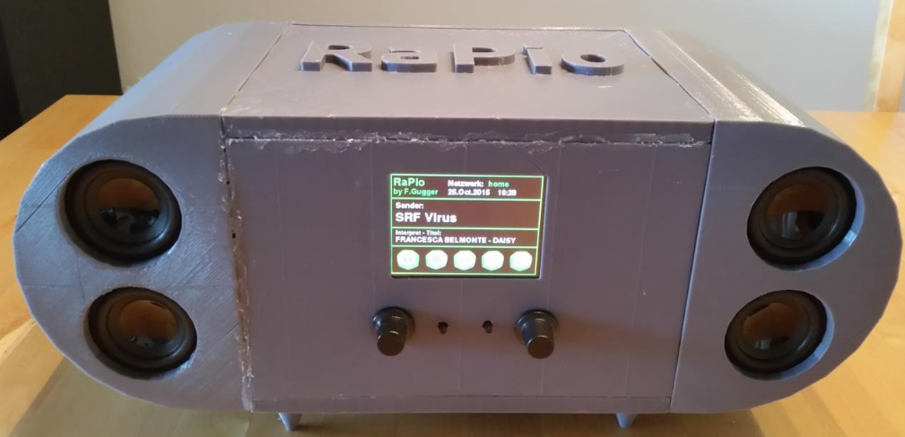
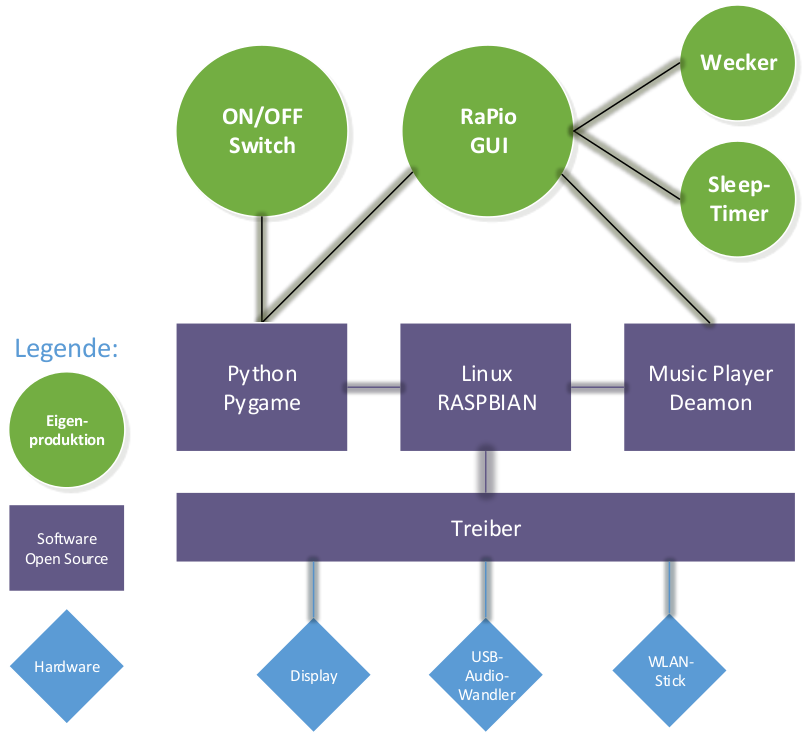

# Diploma thesis RaPio

This was the diploma thesis for my studies to become an electrical engineer HF in 2015.
I equipped a Raspberry Pi Model B Rev 2 with a sound system and a touchscreen to build an internet radio.
It had a touch interface to change channels and set sleep timer and alarm.

As operating system I had used the official Raspian and then implemented the functions with Phyton scripts.

I designed the case myself in Sketchup and then 3D printed it.

Since then a lot has happened and the technology has developed enormously. But it's still funny to see what I did back then :-)

